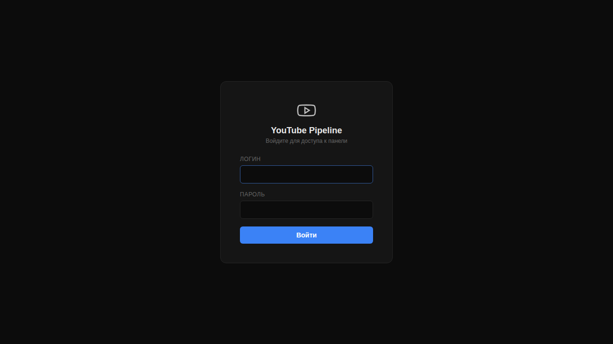

# YouTube Pipeline

Сервис полного цикла производства YouTube-контента — от исследования темы до публикации видео с A/B тестированием обложек.

**Продакшн:** [yt.subbotin.digital](https://yt.subbotin.digital)



## Архитектура

```
Тема → Research → Content Plan → Script → Teleprompter → Covers → Description → Publish
```

### Pipeline Steps

| Шаг | Файл | Что делает |
|-----|-------|-----------|
| Research | `steps/research.py` | Анализ конкурентов, сбор референсов с YouTube |
| Content Plan | `steps/content_plan.py` | Структура видео, ключевые тезисы |
| Script | `steps/script.py` | Полный сценарий с таймкодами |
| Teleprompter | `steps/teleprompter.py` | Текст для телесуфлёра (слово-за-словом) |
| Covers | `steps/covers.py` | Генерация обложек (fal.ai / Recraft / Pillow) |
| Description | `steps/description.py` | SEO-описание, хэштеги, CTA |
| Publish | `steps/publish.py` | Публикация через YouTube Data API |

### Дополнительно

- **A/B Splittest** — `splittest.py` + `splittest_scheduler.py` — автоматическая ротация обложек с отслеживанием CTR
- **Web Admin** — `web/` — Express.js панель управления pipeline
- **Gemini Proxy** — `gemini-proxy-worker.js` — Cloudflare Worker для доступа к Gemini API

## Стек

- **Backend:** Python 3.12 (Anthropic Claude API, YouTube Data API, Pillow)
- **Frontend:** Express.js + vanilla HTML/JS
- **AI:** Claude Sonnet (тексты), fal.ai Nano Banana 2 / Recraft (обложки)
- **Infra:** PM2, Nginx, Let's Encrypt

## Запуск

```bash
# Зависимости
pip install -r requirements.txt
npm install express

# Переменные окружения (.env)
ANTHROPIC_API_KEY=...
YOUTUBE_API_KEY=...
YOUTUBE_CLIENT_ID=...
YOUTUBE_CLIENT_SECRET=...
FAL_KEY=...
RECRAFT_API_KEY=...

# Pipeline
python agent.py --topic "Тема видео"

# Web admin
node web/server.js

# PM2
pm2 start web/server.js --name yt-pipeline-admin
pm2 start splittest_scheduler.py --interpreter python3 --name yt-splittest
```

## Структура

```
├── agent.py                  # Точка входа pipeline
├── pipeline.py               # Оркестрация шагов
├── config.py                 # Конфигурация и env
├── channel_context.json      # Контекст канала (автор, CTA, ссылки)
├── steps/                    # Шаги pipeline
├── web/                      # Express.js админка
├── assets/                   # Стили, текстуры, референсы, одежда
├── fonts/                    # Шрифты для обложек
├── splittest.py              # A/B тест обложек
├── splittest_scheduler.py    # Планировщик ротации
├── thumbnail_generator.py    # Генератор обложек
├── gemini-proxy-worker.js    # CF Worker прокси
└── data/                     # Данные проектов (gitignored)
```
